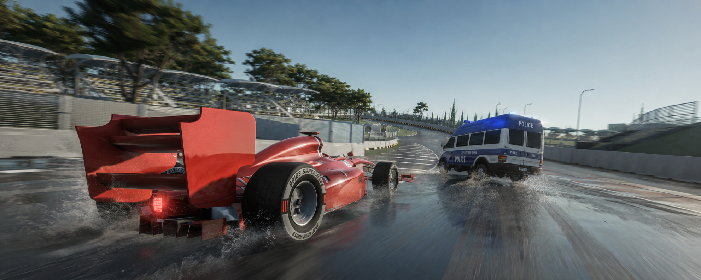

# 🚗 Custom Vehicle Physics

## Data-Driven Vehicle Physics Framework

A custom vehicle physics system built in Unity and C#, focused on understanding and implementing vehicle physics from the ground up rather than relying entirely on Unity's built-in vehicle systems.

The project explores custom wheel physics, suspension, tire forces, traction, friction, slip calculations, chassis movement, and surface interaction through a modular and data-driven architecture.

---

## 🎥 Video Demo

### Custom Vehicle Physics

https://youtu.be/7bqbi1CSBPA?si=DDCUQ0w8ghMFl5aK

---

## 🌐 Portfolio

Full project breakdown, technical details, screenshots, and development information:

https://kaushal-portfolio-liart.vercel.app/Projects/vehicle-controller

---

# Project Information

| | |
|---|---|
| **Role** | Solo Developer |
| **Engine** | Unity |
| **Language** | C# |
| **Platform** | PC |
| **Focus** | Custom Vehicle Physics |
| **Architecture** | Modular & Data-Driven |
| **Status** | In Active Development |

---

# Why I Made It

I started working on this project to understand vehicle physics at a deeper level.

I've always been fascinated by vehicle physics in games such as **GTA, Saints Row, and other open-world driving games**, and I wanted to understand what actually happens underneath the surface.

Rather than relying entirely on Unity's built-in PhysX Rigidbody and collision systems, I wanted to explore how much of the vehicle physics I could build and control myself.

The project became an opportunity to study the relationship between wheels, tires, suspension, forces, and the vehicle chassis while experimenting with different approaches to achieving believable vehicle behavior.

---

# Where Did the Idea Come From?

I had an interview in late 2025 where I was given a task to create a **Forza Horizon-style vehicle controller** using Unity's Character Controller and Raycasts within 24 hours.

The task involved implementing:

- Wheel suspension using Raycasts
- Cinematic camera
- Skidding
- Vehicle sounds
- Collision handling
- Vehicle animation

The project was extremely challenging, but it taught me a lot about physics programming and made me want to explore vehicle systems at a much deeper level.

That experience eventually became the foundation for this project.

---

# The Interesting Part

This isn't just a basic car controller.

The system explores more advanced vehicle physics concepts, including:

- Pacejka-inspired tire modeling
- Friction
- Traction
- Lateral tire forces
- Longitudinal tire forces
- Suspension
- Linear chassis movement
- Rotational chassis movement
- Slip force calculations
- Slip angle calculations
- Wheel-ground interaction
- Surface detection
- Curb interaction

The architecture is **data-driven**, with responsibilities separated across different systems.

This allows vehicle configuration, wheel behavior, body physics, and high-level vehicle control to remain independent and makes the framework easier to extend.

---

# Core Systems

## 🚘 Custom Vehicle Physics

The vehicle's physical behavior is implemented through custom C# systems rather than relying on Unity's built-in `WheelCollider` vehicle solution.

The system is responsible for coordinating:

- Vehicle movement
- Wheel forces
- Suspension
- Tire behavior
- Chassis forces
- Vehicle rotation
- Ground interaction

The goal is to maintain direct control over the physics pipeline.

---

# 🛞 Custom Wheel Physics

Each wheel independently handles its interaction with the environment.

The wheel system is responsible for:

- Wheel-ground detection
- Contact points
- Surface normals
- Suspension behavior
- Wheel forces
- Wheel movement
- Ground interaction

This allows each wheel to contribute independently to the overall behavior of the vehicle.

---

# 📡 Wheel Ground Detection

Wheel-ground interaction is detected using a custom `SphereCast` rather than Unity's `WheelCollider`.

The cast provides information such as:

- Whether the wheel is grounded
- Contact point
- Surface normal
- Distance from the wheel to the surface

This information is then passed into the wheel and suspension calculations to determine the appropriate physical response.

The approach gives the physics system more direct control over how wheels interact with different surfaces.

---

# 🪂 Custom Suspension

The suspension system calculates the displacement of each wheel relative to the vehicle and uses this information to apply forces to the chassis.

This provides control over:

- Suspension travel
- Wheel-ground interaction
- Suspension response
- Vehicle body movement
- Force application

Because the suspension is part of the custom physics pipeline, its behavior can be modified independently from the rest of the vehicle controller.

---

# 🛞 Tire Forces

The project explores tire behavior through separate longitudinal and lateral forces.

### Longitudinal Forces

These contribute to:

- Acceleration
- Braking
- Traction

### Lateral Forces

These contribute to:

- Steering
- Cornering
- Lateral stability

Separating these forces makes it possible to reason about how the tire behaves in different directions rather than treating the wheel as a single generic force source.

---

# 📐 Slip & Slip Angle

The system also explores slip-based tire behavior.

Slip calculations are used to determine how much the wheel's movement differs from the direction or velocity of the tire's contact point.

The project uses slip information to influence tire forces and vehicle response.

This provides a foundation for more advanced tire behavior rather than simply applying movement forces directly to the vehicle.

---

# 🧮 Pacejka-Inspired Tire Modeling

The project experiments with a **Pacejka-inspired tire model** to explore how tire force can change based on slip.

The goal is not simply to make the vehicle move, but to understand how changes in tire conditions affect:

- Traction
- Cornering
- Slip
- Lateral force
- Longitudinal force

This gives the vehicle physics a more structured foundation for experimenting with tire behavior.

---

# 🧱 Curb & Surface Detection

The wheel system also handles uneven geometry such as road curbs.

Surface normals are evaluated to determine whether a detected surface should be treated as valid wheel contact.

The system uses the dot product between the detected surface normal and the vehicle's up direction:

~~~csharp
Vector3.Dot(hit.normal, Vector3.up)
~~~

Surfaces with unsuitable normals can be ignored, preventing wheels from reacting incorrectly to steep or problematic geometry.

This helps produce more natural curb interaction and prevents unwanted wheel behavior when driving over uneven surfaces.

---

# 🏎️ Chassis Physics

The vehicle body responds to the forces generated by the individual wheels.

The physics system explores both:

- Linear chassis movement
- Rotational chassis movement

This allows wheel forces and suspension forces to influence the overall body rather than treating each wheel as an isolated movement system.

---

# Architecture

The vehicle physics is divided into several responsibilities:

~~~text
                     CarControllerV2
                           |
             +-------------+-------------+
             |             |             |
          CarData    CarBodyPhysics   WheelController
                                           |
                                        WheelData
~~~

This separation allows each system to focus on a specific part of the vehicle.

---

## CarControllerV2

Handles high-level vehicle control and coordinates the different vehicle systems.

It acts as the main entry point for vehicle behavior and connects player input with the underlying physics systems.

---

## CarBodyPhysics

Responsible for the physical behavior of the vehicle chassis and the forces acting on the body.

This includes the interaction between forces generated by the wheels and the resulting movement of the vehicle body.

---

## WheelController

Handles individual wheel behavior.

Responsibilities include:

- Ground detection
- Suspension
- Contact information
- Wheel forces
- Surface interaction

---

## WheelData

Contains wheel-specific configuration and runtime information.

This keeps wheel parameters separate from the logic responsible for processing them.

---

## CarData

Contains vehicle-level configuration and parameters.

Separating configuration from the physics logic makes it possible to experiment with different vehicle setups without rewriting the underlying systems.

---

# Architecture Philosophy

The system follows a **separation of responsibilities** approach.

Instead of putting all vehicle physics into one large controller, the system separates:

~~~text
Vehicle Control
       ↓
Vehicle Configuration
       ↓
Wheel Physics
       ↓
Tire Forces
       ↓
Suspension
       ↓
Chassis Physics
~~~

This makes individual parts easier to reason about, debug, and extend.

The data-driven approach also makes it possible to experiment with different vehicle configurations without changing the core physics implementation.

---

# Technical Challenges

### 1. Building Vehicle Physics From Scratch

The project required understanding how wheels, suspension, tire forces, and chassis forces interact rather than relying on a prebuilt vehicle solution.

### 2. Wheel-Ground Detection

Implemented custom wheel-ground detection using `SphereCast` and surface information rather than Unity's `WheelCollider`.

### 3. Suspension

Built custom suspension behavior that translates wheel displacement into forces acting on the vehicle chassis.

### 4. Tire Force Modeling

Experimented with separating longitudinal and lateral tire forces to create more controllable vehicle behavior.

### 5. Slip Calculations

Implemented slip and slip-angle calculations as inputs into the tire force system.

### 6. Surface Interaction

Developed surface and curb detection logic to prevent unsuitable geometry from producing incorrect wheel behavior.

### 7. Chassis Response

Integrated wheel and suspension forces with the vehicle body's linear and rotational movement.

### 8. Modular Architecture

Separated vehicle configuration, wheel behavior, chassis physics, and high-level control into independent systems.

### 9. Iterative Physics Development

Vehicle physics often requires tuning and experimentation because small changes to one part of the system can significantly affect the overall behavior.

This project involved experimenting with different mathematical and physics-based approaches to find reliable implementations.

---

# Current Direction

The project is still a work in progress.

The long-term goal is to expand the framework beyond conventional four-wheel vehicles.

Future areas include:

- Two-wheel vehicles
- Motorcycle balancing
- Additional vehicle-specific physics
- Airborne vehicles
- Planes
- Jets
- Additional surface interaction
- More advanced tire behavior

The broader goal is to eventually turn the system into a more general-purpose vehicle physics framework capable of supporting different types of drivable vehicles.

---

# Technical Focus

This project explores:

- Custom vehicle physics
- Custom wheel physics
- Tire modeling
- Friction
- Traction
- Suspension
- Longitudinal tire forces
- Lateral tire forces
- Slip
- Slip angle
- Pacejka-inspired modeling
- SphereCast
- Surface normals
- Contact points
- Wheel-ground interaction
- Chassis physics
- Linear movement
- Rotational movement
- Curb detection
- Modular architecture
- Data-driven configuration

---

# Technologies

- Unity
- C#
- Rigidbody
- SphereCast
- Unity Physics
- Custom Physics
- Scriptable/Data-Driven Configuration

---

# Project Status

**In Active Development**

The current system provides a foundation for custom vehicle physics and continues to evolve as additional vehicle behaviors and physics systems are explored.

The project is intentionally being developed as a technical physics framework rather than only as a finished driving game.

---

# Repository Contents

This repository contains the C# scripts and programming systems used to implement the vehicle physics.

The complete Unity project is not included because it contains a large number of assets and other project files.

The repository is primarily intended to showcase the underlying **C# gameplay and physics programming** behind the vehicle controller.

---

# Links

### 🌐 Portfolio

https://kaushal-portfolio-liart.vercel.app/Projects/vehicle-controller

### 🎥 Vehicle Physics Demo

https://youtu.be/7bqbi1CSBPA?si=DDCUQ0w8ghMFl5aK
